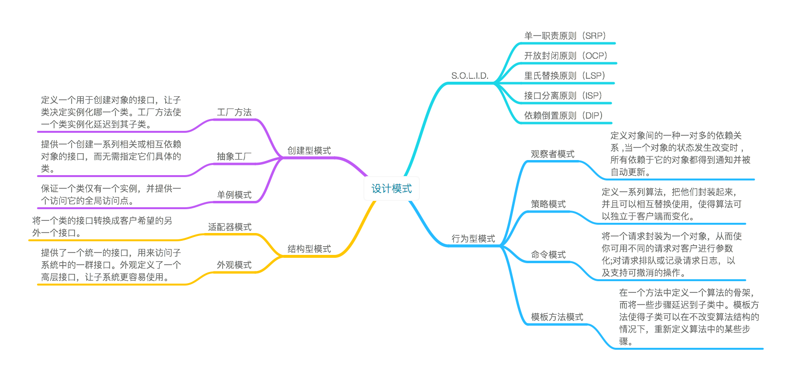

# design-patterns

- [创建型模式](creational/README)
- [行为型模式](behavioral/README)
- [结构型模式](structural/README)

## Reference Books
- [Head First 设计模式](https://book.douban.com/subject/2243615/) 
- [精通 Python 设计模式](https://book.douban.com/subject/26829015/)
- [JavaScript 设计模式与开发实践](https://book.douban.com/subject/26382780/)
